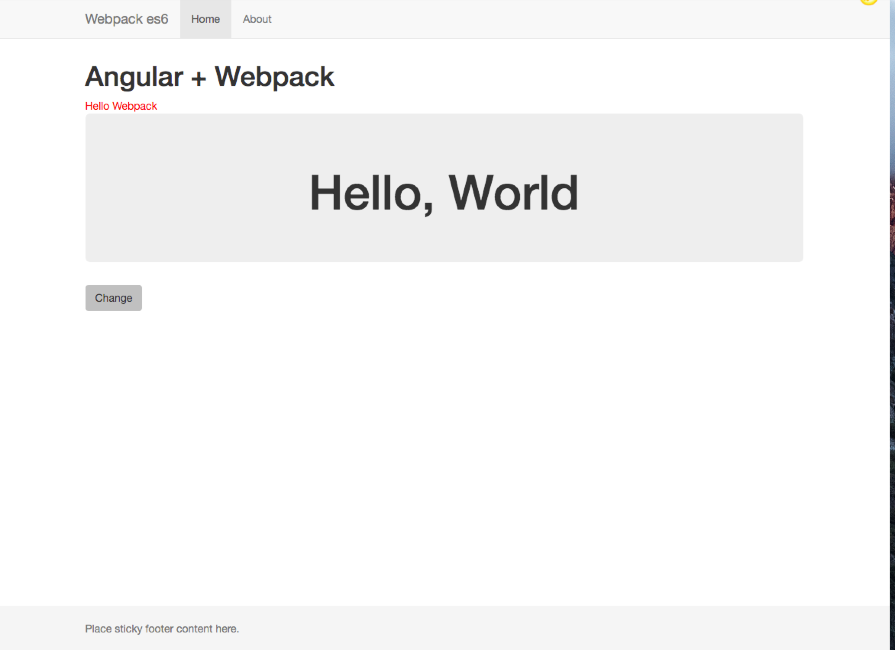

## WAT is this?

This repo is to showcase a usage of webpack. It's:

  * Angular 1.x, 
  * ES6 
  * Babel 6

Idea is based on egghead.io videos and it's goal is glorify modules. 

---

### Requirements

Tools:

  1. node >= 5.x (supports es6) I recommend [nvm](https://github.com/creationix/nvm)
  2. when cloned type:
      

        npm i

    
### Development

How to start a server on `http://localhost:9090/` (bundles are served from memory):

    npm start
    
### Production build
Command to build dist: 

    npm run build

## Run production with http-server:
Command to serve dist files:

    npm run dist
    

#### Other

Remarks about my mistake:
When in `webpack.config.js` you change `module.export` to `module.exports` it's fine with just:

    webpack

## Express server

Might be run with the one of the following (only after `npm run dist`):

    npm run dev (this one uses nodemon)
    node app.js

 Runs on `localhost:3000`.

#### Resolved issues and references:
  
  1. [Angular with Webpack - Introduction](https://egghead.io/lessons/angularjs-angular-with-webpack-introduction?series=angular-and-webpack-for-modular-applications)
  2. [Using Angular 1.x With ES6 and Webpack](http://angular-tips.com/blog/2015/06/using-angular-1-dot-x-with-es6-and-webpack/)
  3. [.babelrc or package.json: babel section](https://babeljs.io/docs/usage/babelrc/)
  4. [babel6 plugin for module exports](https://github.com/59naga/babel-plugin-add-module-exports)

#### License
[LICENSE](LICENSE)

### Preview

## TODO

1. test to use angular mocks
2. MONDO integration

[Mondo](https://getmondo.co.uk/) is cool, check it out ;) Here I've created a basic angular integration with its API.

[Mondo API](https://getmondo.co.uk/docs/)